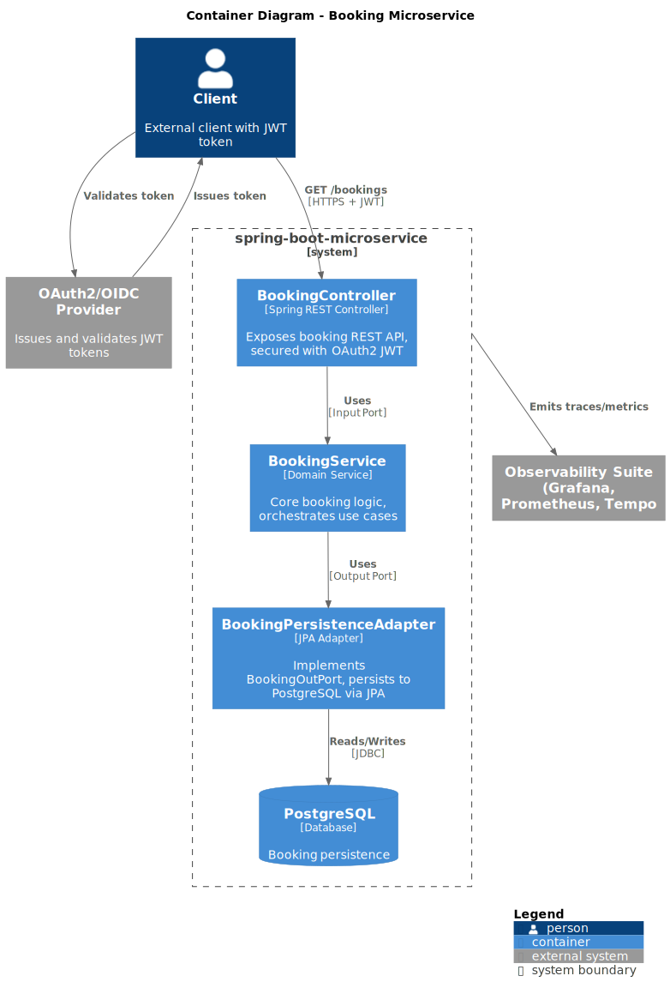

[](https://github.com/trettstadt/spring-boot-microservice/actions/workflows/maven.yml)

# Booking Microservice

This is a template for a production-hardened Spring Boot microservice demonstrating enterprise-grade
architecture, security, and observability. It reduces the time needed to bootstrap a new service
significantly while ensuring up-to-date architecture and security. It is optimized to be deployed in
a Kubernetes cluster using the GitOps paradigm.

## Domain

A **booking management service** that stores bookings (e.g., hotel reservations) in PostgreSQL with
OAuth2-protected REST API. External services (e.g., Rooms) can be called via the OpenAPI-generated
REST client with OAuth2 client credentials.

## Architecture

Ports and Adapters (Hexagonal) with clean separation between domain, application, and infrastructure
layers.



> **Diagram source:** [docs/architecture.puml](docs/architecture.puml) — modify with
> the [C4-PlantUML VS Code extension](https://marketplace.visualstudio.com/items?itemName=elpd.plantuml-preview).

### Layer Overview

| Layer             | Package                      | Responsibility                                                    |
|-------------------|------------------------------|-------------------------------------------------------------------|
| **Adapter — In**  | `adapter.in.rest`            | REST controller, maps HTTP → use case via input ports             |
| **Application**   | `application.domain.service` | Domain service — pure business logic, no framework deps           |
| **Application**   | `application.port.in`        | Input port interfaces (use cases)                                 |
| **Application**   | `application.port.out`       | Output port interfaces (contracts for external concerns)          |
| **Adapter — Out** | `adapter.out.persistence`    | JPA persistence adapter (implements `BookingOutPort`)             |
| **Adapter — Out** | `adapter.out.rooms`          | REST client adapter (implements `RoomOutPort`, OpenAPI-generated) |

## Features and Technologies

- **Java 25** / **Spring Boot 4** — modern stack with GraalVM native image support
- **Ports and Adapters architecture** —
  see [ADR 0004](docs/adr/0004-ports-and-adapters-architecture.md)
- **OAuth2 / OIDC** — JWT-based security on both server (resource server) and outbound REST clients
- **OpenAPI codegen** — server stub from `booking/openapi.yaml`, client from `rooms/openapi.yaml`
- **Observability** — Micrometer metrics + OpenTelemetry tracing, including datasource
  instrumentation
- **Database migrations** — Liquibase changelog-driven schema management
- **Quality gates** — Checkstyle, PMD, SpotBugs, JaCoCo (60% complexity coverage minimum)

## Quick Start

```bash
# Build
./mvnw package -DskipTests

# Run (requires PostgreSQL + Docker Compose, see localdev/)
docker compose -f localdev/docker-compose.yaml up -d
./mvnw spring-boot:run

# Tests
./mvnw verify  # unit tests + integration tests
```

## API

`GET /bookings` — returns all bookings.

**Request:**

```
GET /bookings
Authorization: Bearer <JWT with scope:bookings>}
```

**Response:**

```json
{
  "data": [
    {
      "id": 1,
      "description": "Jane Doe — May 1–5, 2026"
    }
  ]
}
```

## Quality & CI

- **Checkstyle** — Google code style checks
- **PMD** — static source code analysis
- **SpotBugs** — bytecode-level bug detection
- **JaCoCo** — 60% minimum complexity coverage enforced on every build
- **GitHub Actions** — CI pipeline with test, lint, and coverage gates

## Project Structure

```
src/main/java/de/trettstadt/microservices/springbootmicroservice/
├── adapter/
│   ├── in/rest/          # REST controllers, API mappers (C4: Container)
│   └── out/
│       ├── persistence/   # JPA entities, repositories, persistence adapter
│       └── rooms/         # OpenAPI-generated REST client for Rooms service
├── application/
│   ├── domain/service/   # Domain services (framework-free business logic)
│   └── port/
│       ├── in/            # Input port interfaces (use cases)
│       └── out/           # Output port interfaces (persistence, external APIs)
├── common/
│   └── config/            # Security, observability, and infrastructure config
└── SpringBootMicroserviceApplication.java
```

## Kubernetes Deployment

The Helm chart at `gitops/booking/` deploys the service to Kubernetes.

### Prerequisites

The chart can optionally integrate with [External Secrets Operator](https://external-secrets.io/latest/)
to manage the database password from an external keystore (AWS Secrets Manager, GCP Secret Manager,
HashiCorp Vault, etc.). This requires the ESO CRDs and operator to be installed in the cluster.

Install ESO with Helm (recommended):

```bash
helm repo add external-secrets https://charts.external-secrets.io
helm upgrade -i external-secrets external-secrets/external-secrets \
  -n external-secrets --create-namespace
```

This installs both the operator and its CRDs (`SecretStore`, `ClusterSecretStore`, `ExternalSecret`).

To install only the CRDs without the operator (e.g. when using a managed ESO installation):

```bash
kubectl apply -f https://raw.githubusercontent.com/external-secrets/external-secrets/main/deploy/crds/bundle.yaml \
  --server-side
```

> CRD bundles exceed the 256 KB size limit, so `--server-side` is required for `kubectl apply`.

### Configuration

Set `externalSecrets.enabled=true` and configure the SecretStore provider and remote ref in your
values file (see `values.yaml` for all options):

```yaml
externalSecrets:
  enabled: true
  store:
    spec:
      provider:
        aws:
          service: SecretsManager
          region: us-east-1
          auth:
            secretRef:
              accessKeyIDSecretRef:
                name: aws-creds
                key: access-key
  secret:
    remoteRef:
      key: /booking/database
      property: password
```

When ESO is disabled (default), no secret volume is mounted and the ConfigMap's
`spring.config.import` falls back gracefully via `optional:file:`.

## Key Design Decisions

| ADR                                                       | Decision                                    |
|-----------------------------------------------------------|---------------------------------------------|
| [0002](docs/adr/0002-use-java-as-programming-language.md) | Java as programming language                |
| [0003](docs/adr/0003-use-spring-boot-as-framework.md)     | Spring Boot as framework                    |
| [0004](docs/adr/0004-ports-and-adapters-architecture.md)  | Ports and Adapters (Hexagonal) architecture |